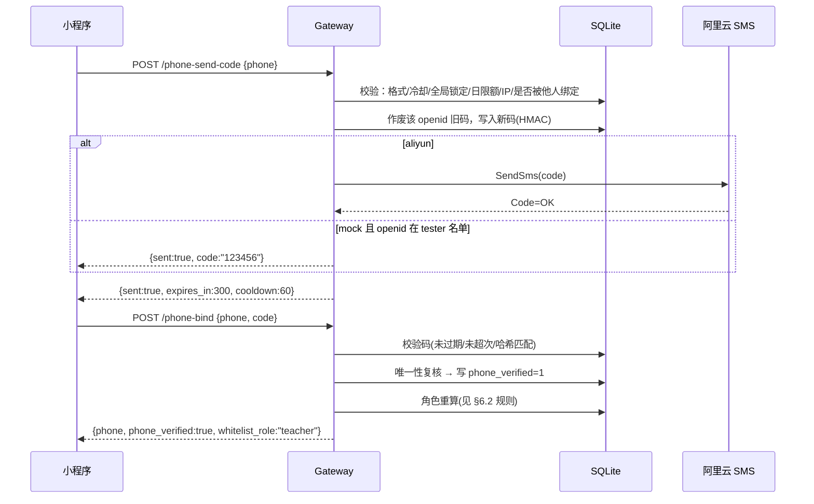

# 手机号短信验证与强制绑定设计

> 版本: 1.2 · 日期: 2026-09-15 · 状态: 设计评审（决策已锁定）
> 范围: 小程序端「手机号」绑定链路（短信验证码 + 强制绑定 + 解绑），仅学业规划助手实例。
> 关联: `docs/02-features/002-academic-warning-miniapp-design.md`。
> v1.1 变更：对照代码与阿里云官方文档逐条核验后修正 §5.3 迁移落点、§7 签名算法、§8.1 前端拦截机制、§6 计数与角色重算规则；新增 §12 最佳实践差距清单与 §18 事实依据表。
> v1.2 变更：锁定 2026-09-15 第二轮拍板结论——签名 V3、前端全量迁移 `utils/request.js`、改号不验旧号不通知不设冷静期、单通道降级、保留 `phone_taken` 文案、启用前清理联调残留、索引失败跳过；§12 状态由「待确认」改为最终结论。

## 1. 背景与目标

现状（原电话白名单交接文档已移除）手机号绑定有三条问题链路：

1. 线上 `PHONE_VERIFY_MODE=dev`，`POST /api/methods/phone-bind` 的 `mock_phone` 直绑：**任何用户填白名单里的任意号码即可获得 teacher/admin/owner 身份**（`adapter.py:1302`，dev 分支 `:1312-1318`）。
2. 微信 `getPhoneNumber` 模式因小程序未开通权限（errno 102）不可用（`jwc.js:20-22`）。
3. `PUT /api/methods/admission-profile` 可改 `phone` 却不动 `phone_verified`（`_method_admission_profile_update` 的 `ON CONFLICT` 只更新 phone），导致「号码已改、验证标记仍为真」的不一致。

同时白名单已成为 miniapp 端授予 teacher/admin 的**唯一自助通道**（`_method_apply_auth` 角色门，agent4som `0acf09b`）。

**目标**：

- 用**短信验证码**校验号码真实归属，替换现有 `dev` 直绑与微信授权两条路径；
- 档案电话字段纳入同一验证链路，修掉 `phone_verified` 不一致；
- 教务实例开启**强制绑定**：未绑定手机号者不能使用小程序（登录仍可，业务端点被拦截）；
- 一号一账号、可自助/管理员解绑、全程可审计。

## 2. 已确认决策（2026-09-15 访谈）

| 项 | 决策 |
|----|------|
| 路径替换 | 启用路径**只有 sms**；`getPhoneNumber`（wechat）分支代码保留但实例不引用（deprecated，将来权限开通可回切）；`dev/mock_phone` 直绑分支**删除**，由 mock 短信流程取代 |
| 档案电话 | 电话字段纳入验证；`PUT /admission-profile` **不再允许改 phone**，电话只能由绑定流程改写（修掉 §1.3 不一致） |
| 教务实例 | `FEATURES.phoneAuthMode='sms'`；正式弃用 dev 直绑 |
| 测试期 | 短信未开通，`SMS_PROVIDER=mock`：后端生成并**回显验证码**，不透传真实短信 |
| 阿里云接入 | 不引 SDK，用标准库自签名调 `SendSms`（签名版本见 §7，**待确认**） |
| 验证码 | 6 位；有效期 5 分钟；重发冷却 60s；单码最大尝试 5 次；单手机号 20 次/日；单 openid 20 次/日 |
| 存储 | SQLite（有效码表 + 追加审计日志表），码存 HMAC 哈希 |
| 号码绑定 | **不发码前置白名单要求**（任何人都可绑，仅白名单给身份） |
| 一号一账号 | **严格**：号码已被其他 openid 绑定 → 拒绝 `phone_taken`，解绑须本人或管理员 |
| 角色规则 | **首次绑定不降级**（仅命中白名单才 `set_role`，否则不动既有角色）；**换绑（已有已验证号码且不同）全量重算**（命中 `set_role`，否则 `unset_role`）。见 §6.2 |
| 换号作废 | 同一 openid 再发码时，作废其此前所有有效码；改号后旧号验证码作废 |
| 响应 | 绑定成功返回 `whitelist_role`，前端回显拿到的身份 |
| 强制绑定 | 由 `SMS_PROVIDER=='aliyun'`（真短信）**自动派生**；mock 阶段不强制（避免测试期线上 jwc 全量用户被锁） |
| 强制范围 | 对**所有人**（含已有显式角色的 staff）；首次绑定后其既有角色保留 |
| 风控强度 | 冷却 + 尝试上限 + 全局失败锁定 + 日限额 + IP 维度限流；不上图形验证码 |
| 白名单权限 | 白名单仍可直接授予最高身份（admin/owner），不降级 |
| mock 加闸 | 仅 `SMS_TEST_OPENIDS` 名单内 openid 可见验证码回显；其他 openid 照常返回「已发送」但不送达、不可完成 |
| 解绑入口 | 本人解绑（验证当前号码）+ 管理员在「电话白名单」页解绑 |
| 改号策略 | **不验证旧号、不通知旧号**（A1）；**无冷静期/撤销窗口**（A2） |
| 故障降级 | **单通道**，短信不可用即停 + 带外恢复（A3） |
| 找回指引 | 小程序内提供「号码不可用」提示文案 + 管理员联系方式（A4） |
| 号码枚举 | 保留明确的 `phone_taken` 文案（A5） |
| 联调残留 | `test_user_002 / 13900000001` **启用前清理**（A6） |
| 签名版本 | **V3 `ACS3-HMAC-SHA256`**（C1，锁定） |
| 前端封装 | **全部页面统一迁移**到 `utils/request.js`（C2） |
| 索引失败 | 重复号码时记错误、**跳过建索引、不阻断启动**（C3） |
| 灰度 | 仅教务实例；强制绑定随真短信自动开启 |
| 交付 | 本文档，中文，含时序图/接口/DDL/边界/回滚 |

## 3. 范围

**In scope**：后端短信验证码发送/校验、绑定/解绑、角色重算、强制绑定闸、SQLite 表与迁移、前端绑定交互、配置与上线。

**Out of scope**：阿里云短信开通与模板报备流程本身（运营事项）；`getPhoneNumber` 权限申请；白名单导入/批次逻辑改造（仅增加「解绑该号码」操作）；工单/预警等其他链路。

## 4. 总体设计

### 4.1 架构

```
小程序 (miniprogram-framework-frontend/pages/profile)
   │  Bearer token（经 utils/request.js 统一封装，见 §8.1）
   ▼
miniapp gateway (aiohttp, 127.0.0.1:8010)
   ├─ POST /api/methods/phone-send-code   → SMS 模块
   ├─ POST /api/methods/phone-bind        → 校验码 → admission_profiles → roles.json
   ├─ POST /api/methods/phone-unbind      → 本人解绑（验证当前号码）
   └─ POST /api/methods/phone-whitelist/unbind → 管理员解绑
   │
   ├─ SMS_PROVIDER=mock  → 本地生成码，tester openid 回显
   └─ SMS_PROVIDER=aliyun→ 自签名调 https://dysmsapi.aliyuncs.com (SendSms，V3)
```

身份链路（沿用白名单模型，仅把「号码可信来源」换成短信）：

```
登录 → token(openid) → 绑定手机（短信验证）→ admission_profiles(phone_verified=1)
   → 命中 phone_whitelist（最新条目）→ set_role → roles.json → resolve_role
```

### 4.2 绑定时序（成功路径）



### 4.3 强制绑定闸

- 开关**派生**：`REQUIRE_PHONE_BIND = (SMS_PROVIDER == 'aliyun')`，不单独配置。
- 登录仍照常签发 token（`/api/miniapp/login` 不变）；闸加在**受保护业务端点**。
- 实现：新增统一前置检查（装饰器 `@requires_phone_bound` 或等价的集中包装），未绑定返回
  `403 {"error":"请先绑定手机号","code":"phone_bind_required"}`。
- **豁免端点**（否则会死锁）：
  `/health`、`/api/miniapp/login`、`/api/methods/identity`、`POST /api/methods/phone-send-code`、`POST /api/methods/phone-bind`。
  （`phone-unbind` 需已绑定，不豁免。）
- **风险**：`connect()` 中约 40 个 `add_*` 路由（`adapter.py:115-167`），逐个加装饰器易漏。实现要求：
  1. 集中维护「豁免路径白名单」，其余一律视为受保护；
  2. 用一轮启动期自检打印未覆盖的路由，或在路由注册处统一包裹，避免漏挂。
- 前端：`utils/request.js` 统一拦截该 403 → 跳转到档案页并高亮绑定卡片（见 §8.1）。

### 4.4 首个管理员引导（bootstrap）

绑定入口本身在豁免列表内，不依赖任何已有管理权限，闭环成立：

1. DB 已预置 owner 号码 `15240860374` 的白名单条目与绑定行（实测 `admission_profiles`：`osMZS12qTk3RMfVW_9Wg2OjypXTQ / 15240860374 / phone_verified=1`）；
2. owner 登录 → 绑定该号码 → 命中白名单 → `owner` → 进管理页；
3. 用「电话白名单」页给其他管理员加号码，对方自助绑定；
4. 若白名单为空或首个号码丢失 → **带外恢复**（服务器直改 DB / `roles.json`，见 §11）。

## 5. 数据模型

新增于 `knowledge_base/repository/sqlite_metadata.py` 的 `DatabaseManager.initialize()`（与 `phone_whitelist_batch` 同处，`sqlite_metadata.py:42`；`initialize()` 在 `MiniappAdapter.__init__` 启动时调用，`adapter.py:98-99`），幂等建表。

### 5.1 有效验证码表

```sql
CREATE TABLE IF NOT EXISTS phone_verification (
  phone          TEXT PRIMARY KEY,          -- 目标号码（同一号码仅一条有效码）
  code_hash      TEXT NOT NULL,             -- HMAC-SHA256(SMS_HASH_KEY, code)
  request_openid TEXT NOT NULL,             -- 发起人
  expires_at     TEXT NOT NULL,             -- UTC ISO8601
  attempts       INTEGER NOT NULL DEFAULT 0,
  last_sent_at   TEXT NOT NULL,
  created_at     TEXT NOT NULL DEFAULT (datetime('now'))
);
```

计数口径（v1.1 明确，避免双写）：本表**不存**任何日计数；所有限额（手机号/openid/IP）**统一从 `phone_verification_log` 聚合**（已建索引）。冷却用本表 `last_sent_at`。

### 5.2 审计日志表（追加写）

```sql
CREATE TABLE IF NOT EXISTS phone_verification_log (
  id         INTEGER PRIMARY KEY AUTOINCREMENT,
  phone      TEXT NOT NULL,
  openid     TEXT NOT NULL,     -- 事件主体（被解绑者 / 请求者）
  actor      TEXT,              -- 操作者（管理员解绑时记录管理员 openid；普通事件=openid）
  action     TEXT NOT NULL,     -- send | verify_ok | verify_fail | unbind
  reason     TEXT,              -- 拒绝/失败原因；成功为空
  ip         TEXT,
  mocked     INTEGER NOT NULL DEFAULT 0,
  created_at TEXT NOT NULL DEFAULT (datetime('now'))
);
CREATE INDEX IF NOT EXISTS idx_pvl_openid_created ON phone_verification_log(openid, created_at);
CREATE INDEX IF NOT EXISTS idx_pvl_phone_created  ON phone_verification_log(phone, created_at);
CREATE INDEX IF NOT EXISTS idx_pvl_ip_created     ON phone_verification_log(ip, created_at);
```

- 日志中号码**脱敏**（`152****0374`）后再写入；其余表存全号。
- **留存**：默认保留 `SMS_LOG_RETENTION_DAYS=90`，启动时清理过期行（PIPL 最小化，见 §12）。

### 5.3 一号一账号唯一约束（**v1.1 修正迁移落点**）

问题：`admission_profiles` 基表 schema（`sqlite_metadata.py:328`）**没有** `phone_verified` 列，它由 adapter 的 `_ensure_admission_profile_columns`（`adapter.py:2179`）在**首次请求时**懒加载。若把唯一索引直接放进 `DatabaseManager.initialize()` 的 `SCHEMA_SQL`，全新 DB 上此时列不存在，`CREATE UNIQUE INDEX ... WHERE phone_verified=1` 会报错并**阻断启动**。

修正后的迁移顺序（在 `initialize()` 内、`_ensure_phone_whitelist_batch_schema` 之后）：

1. 先 `_ensure_column(conn, "admission_profiles", "phone_verified", "INTEGER NOT NULL DEFAULT 0")`；
2. 重复校验（失败则记错误并**跳过**建索引，不阻断启动）：
   ```sql
   SELECT phone, COUNT(*) c FROM admission_profiles
    WHERE platform='miniapp' AND phone_verified=1
    GROUP BY phone HAVING c > 1;
   ```
   （实测当前无重复，可正常建索引。）
3. 建索引：
   ```sql
   CREATE UNIQUE INDEX IF NOT EXISTS ux_admission_phone_verified
     ON admission_profiles(phone)
     WHERE platform='miniapp' AND phone_verified=1;
   ```

SQLite 版本实测 3.42.0，支持部分索引。

## 6. 接口设计

全部要求 `Authorization: Bearer <token>`（登录/健康检查除外）。错误统一 `{"error","code"}`。
IP 来源：默认 `request.remote`；若前置反代，需反代注入 `X-Forwarded-For` 并由受信代理链解析（**当前反代配置未定位，见风险 R11**）。

### 6.1 POST /api/methods/phone-send-code

请求：`{"phone":"15240860374"}`

前置校验与限流（顺序）：

1. 格式：`1\d{10}`，否则 `400 invalid_phone`；
2. 已被**其他** openid 绑定（`phone_verified=1`）→ `400 phone_taken`；
3. 冷却：该号码 `last_sent_at` < 60s → `429 rate_limited` + `Retry-After`；
4. 全局失败锁定：该 openid/号码在窗口内连续失败 ≥10 次 → `429 locked`（见 §6.5）；
5. 日限额：该号码 ≥20 次/日 **或** 该 openid ≥20 次/日 → `429 rate_limited`；
6. IP 限流：同 IP send ≥10 次/小时 → `429 rate_limited`。

动作：

- 作废该 openid 名下**所有**有效码（改号/重发作废旧码）；
- 生成 6 位随机码（`secrets` 模块），写 `phone_verification`（哈希存储）；
- `SMS_PROVIDER=aliyun`：自签名调用 SendSms；失败 → `502 sms_send_failed`，**不写码、不计冷却与日额度**，仅记日志；
- `SMS_PROVIDER=mock`：不回真实短信；仅当 openid ∈ `SMS_TEST_OPENIDS` 时响应带 `code`。

响应：`{"sent":true,"expires_in":300,"cooldown":60}`（mock tester 追加 `"code":"123456","mocked":true`）。

### 6.2 POST /api/methods/phone-bind

请求：`{"phone":"...","code":"123456"}`

校验：

- 无有效码 / 已过期 / 哈希用 `hmac.compare_digest` 不匹配 → `400 invalid_code`（统一文案「验证码错误或已过期」，精确原因仅入日志）；
- 不匹配时 `attempts+1`，达到 5 次即作废该码并记 `too_many_attempts`；
- 唯一性**复核**（防并发）→ `phone_taken`。

动作：

- 删除该有效码；写 `admission_profiles.phone, phone_verified=1`（`ON CONFLICT(platform,user_id)`）；
- **角色规则（v1.1 消除歧义）**：
  - **首次绑定**（此前该 openid 无 `phone_verified=1`）：`_whitelist_role_for_phone(phone)` 命中才 `set_role`，**未命中不动既有角色**（保留人工/其他来源角色）；
  - **换绑**（此前已有已验证号码且与本次不同）：**全量重算**——命中 `set_role`，未命中 `unset_role`（回默认 student）。
- 校验成功记 `verify_ok`。

响应：`{"phone":"...","phone_verified":true,"whitelist_role":"teacher"}`（无命中原为 `""`）。
重复绑同一号码（本人）→ 幂等成功。

### 6.3 POST /api/methods/phone-unbind（本人解绑）

请求：`{"code":"123456"}`（验证码发往**当前已绑定号码**，故无 phone 字段）

- 校验当前 openid 有 `phone_verified=1`，否则 `400 not_bound`；
- 校验码同 §6.2（全局失败锁定同样适用）；
- 动作：清空 phone、`phone_verified=0` → 号码释放；角色重算（无号 → `unset_role`，回默认 student）；
- 记 `unbind`（`actor=openid`）。

响应：`{"phone_verified":false}`。

### 6.4 POST /api/methods/phone-whitelist/unbind（管理员解绑）

请求：`{"phone":"15240860374"}`；调用者须 `admin`/`owner`（`_require_role` `adapter.py:425`），否则 `403`。

- 按 phone 找 `platform='miniapp' AND phone_verified=1` 的 openid → 清空、角色重算、号码释放；
- 不删任何白名单条目；
- 记 `unbind`（`openid=被解绑者`，`actor=管理员 openid`）。

响应：`{"unbound":true,"openid":"..."}`（无绑定行则 `unbound:false`）。

配套：`GET /api/methods/phone-whitelist` 的 `items`（`_method_phone_whitelist_list` `adapter.py:1906`）增加 `bound` 字段（该号码是否已被绑定），供管理页展示与解绑按钮。

### 6.5 全局失败锁定（新增）

- 以 `phone + openid` 为键，统计最近 15 分钟内 `verify_fail` 次数；
- ≥10 次 → 该键锁定 30 分钟，期间 `phone-send-code` 与 `phone-bind`/`phone-unbind` 返回 `429 locked`；
- 成功一次 `verify_ok` 后清零（按时间窗口自然过期）。

## 7. 阿里云短信接入（自签名）

> ✅ **v1.2 锁定**：签名版本确定为 **V3 `ACS3-HMAC-SHA256`**（官方推荐）。本节按 V3 编写；实现时先用 OpenAPI Explorer 生成签名样例做对照，避免手写偏差。

**已从官方文档核实的事实**：

- 服务地址 `dysmsapi.aliyuncs.com`，`Action=SendSms`，`Version=2017-05-25`，请求风格 RPC，推荐 POST。
- 必填业务参数：`PhoneNumbers`、`SignName`、`TemplateCode`；`TemplateParam` 为 **JSON 字符串**（如 `{"code":"123456"}`）；**参数表中没有 `RegionId`**（旧文档里的 RegionId 非必需）。
- `SignName`/`TemplateCode` 必须是**审核通过**的签名/模板；**测试短信的号码须先在短信控制台绑定**。
- **接口不支持幂等**：重试可能重复发送，需在应用层去重（本项目按「同一 openid 已存在有效码即不重复发送」控制）。
- 超时建议 ≥1s；国内短信按运营商回执计费（提交成功但回执失败不计费）。QPS 上限 5000/秒（本场景远低于）。

**V3 签名要点**（`ACS3-HMAC-SHA256`）：

1. 规范请求：`POST` + `/` + canonical query（按 key 排序、RFC3986 编码）+ `x-acs-*` 头
   （`x-acs-action: SendSms`、`x-acs-version: 2017-05-25`、`x-acs-date`(ISO8601 UTC)、`x-acs-signature-nonce`、`x-acs-content-sha256`=SHA256(空体)）；
2. `StringToSign` = `ACS3-HMAC-SHA256\n` + SHA256(canonicalRequest)；
3. `Signature` = hex(HMAC-SHA256(AccessKeySecret, StringToSign))；
4. `Authorization: ACS3-HMAC-SHA256 Credential=<AccessKeyId>,SignedHeaders=...,Signature=<...>`。

- 成功判定：响应 `Code == "OK"`；否则记录 `Code/Message` 并返回 `502`。
- 超时 10s；异步调用（`aiohttp`），失败不影响进程。
- 依赖：**不新增任何 Python 包**（标准库 `hmac/hashlib/base64/urllib.parse` + 现有 `aiohttp` + `requests`）。
- 实现前用 OpenAPI Explorer 生成一次签名样例做对照测试（避免手写签名偏差）。

## 8. 前端交互

### 8.1 入口与页面

- 绑定界面放在 `pages/profile/`（不新建页面，`build.js` 的 `SHARED_PAGES` 无需改动）：
  - **查看模式**新增「手机号」卡片：未绑定显示输入框 + 「获取验证码」；已绑定显示全号 + 「已验证」+「更换手机号」/「解绑」。
  - **编辑模式移除电话输入**（电话只由绑定卡片改），与 §2 决策一致。
- **新增 `utils/request.js`（v1.2：全部页面统一迁移）**：现状前端无统一请求封装（`utils/` 仅有 `instance-keys.js`，各页直接 `wx.request`），不存在可挂全局拦截的地方。新增薄封装（注入 token、统一处理 401/403），并**把所有页面的 `wx.request` 调用统一迁移过来**，避免强制绑定拦截有漏网。
- `config/instances/jwc.js`：`FEATURES.phoneAuthMode: 'sms'`。
- `config/api.js`：新增 `METHODS_PHONE_SEND_CODE`、`METHODS_PHONE_UNBIND`、`METHODS_PHONE_WHITELIST_UNBIND`。
- 移除 `bindPhoneManual`；`bindPhoneAuth`（wechat）保留但不再被 `phoneAuthMode==='sms'` 命中（deprecated）。

### 8.2 交互细节

- 「获取验证码」仅当 `1\d{10}` 时可用；点击后置灰 60s 倒计时（「60s 后重发」）；
- 发码成功出现验证码输入框（6 位数字）与「验证并绑定」；
- **输入号码变化**：清空已填验证码、取消倒计时（后端按 phone 存码，旧号码在换号发码时被作废）；
- 成功：Toast「手机号已验证」；若有 `whitelist_role` 回显「身份：教师/管理员/负责人」；
- 失败：按 `code` 映射文案（`invalid_code`→「验证码错误或已过期」、`phone_taken`→「该号码已被其他账号绑定，请联系管理员」、`rate_limited`→「操作过于频繁，请稍后再试」、`locked`→「尝试次数过多，请 30 分钟后再试」、`sms_send_failed`→「验证码发送失败，请稍后重试」、`sms_unavailable`→「短信服务暂不可用」）；
- 强制绑定：`utils/request.js` 捕获 `403 phone_bind_required` → `wx.navigateTo`/`switchTab` 档案页并高亮卡片；
- **号码不可用/已被占用**（A4）：绑定卡片展示引导文案「号码无法使用？请联系管理员：<管理员联系方式>」，联系方式取自实例配置；
- 视觉沿用现有基线（≥64rpx 触控、`env(safe-area-inset-bottom)`）。

### 8.3 电话白名单管理页

条目增加「已绑定」标记与「解绑」按钮（调 §6.4）；解绑前二次确认（沿用 dry-run 风格的前端确认）。

## 9. 配置

放 `agent4som-hermesagent/.env`（对应网关实例）：

```ini
SMS_PROVIDER=                 # mock | aliyun；留空=功能禁用（端点 503）
SMS_ALLOW_MOCK=               # mock 必需；非 true 时 mock 不生效
SMS_TEST_OPENIDS=             # 逗号分隔，mock 下可见验证码的 openid
SMS_HASH_KEY=                 # 验证码 HMAC 密钥（随机长串）；缺失则禁用短信端点
SMS_LOG_RETENTION_DAYS=90     # 审计日志留存天数
ALIYUN_ACCESS_KEY_ID=
ALIYUN_ACCESS_KEY_SECRET=
ALIYUN_SMS_SIGN_NAME=
ALIYUN_SMS_TEMPLATE_CODE=
ALIYUN_SMS_TEMPLATE_PARAM_NAME=code
```

**常量硬编码在代码**（不做成配置项）：TTL=300s、COOLDOWN=60s、MAX_ATTEMPTS=5、DAILY_PHONE=20、DAILY_OPENID=20、IP_SEND_HOURLY=10、IP_VERIFY_HOURLY=30、FAIL_LOCK_THRESHOLD=10、FAIL_LOCK_WINDOW=15min、FAIL_LOCK_DURATION=30min。

启动校验（在 `MiniappAdapter.__init__` / `connect()` 记录）：

- `SMS_PROVIDER=aliyun` 且密钥/签名/模板缺失，或 `SMS_HASH_KEY` 缺失 → 记录错误并让短信端点返回 503（fail-fast），不阻断网关其他功能；
- `SMS_PROVIDER=mock` 且 `SMS_ALLOW_MOCK!=true` → mock 不生效并告警；
- mock 生效时打醒目启动告警（`WARNING: SMS mock provider enabled`）。

## 10. 边界与错误处理

| 场景 | 行为 |
|------|------|
| 号码格式非法 | `400 invalid_phone` |
| 号码已被他人绑定 | 发码阶段与绑定阶段均 `400 phone_taken` |
| 60s 内重发 | `429 rate_limited` + `Retry-After` |
| 日限额超限（号码/openid） | `429 rate_limited` |
| IP 超限 | `429 rate_limited` |
| 连续失败 ≥10 次 | `429 locked`（30 分钟） |
| 验证码错误/过期 | `400 invalid_code`，统一文案；错 5 次作废该码 |
| 未发码直接绑定 | `400 code_not_requested` |
| 同一 openid 换号后旧号码 | 发新号码时作废该 openid 全部旧码 |
| 已绑定者重复绑同号 | 幂等成功 |
| 首次绑定非白名单号 | 不降级，保留既有角色 |
| 换绑到非白名单号 | `unset_role` → 默认 student |
| 阿里云调用失败 | `502 sms_send_failed`，不写码、不计冷却/额度 |
| provider 未配置/密钥缺失 | 短信端点 `503 sms_unavailable` |
| 未绑定访问业务端点 | `403 phone_bind_required`（除豁免端点） |
| mock 非 tester openid | 返回「已发送」但不送达、不可完成，记日志 |
| 管理员号码被占用需收回 | 管理员在管理页解绑后释放 |
| 历史 `phone_verified=1` 用户 | 祖父继承，无需重新验证 |
| 历史未验证 phone 行 | 保留；新流程不再产生（PUT 不再改 phone） |
| `test_user_002 / 13900000001` 联调残留 | **P2 启用前清理**该行（A6） |

## 11. 强制绑定与账号恢复

- 生效条件见 §4.3；mock 阶段不生效。
- **豁免与保留**：强制对所有人；已绑任意有效号码即通过；首次绑定不降既有角色（§6.2）。
- **恢复兜底**：owner/管理员误操作或阿里云故障时，服务器带外恢复（先在 shell 加载部署 `.env` 以获得 `HERMES_HOME`/`AGENT4SOM_REPO`）：

  ```bash
  # 1) 修正 roles.json（事实来源，ROLES_PATH=HERMES_HOME/roles.json，role_store.py:40-42）
  #    编辑 $HERMES_HOME/roles.json 的 miniapp 段
  # 2) 修正 DB 绑定标记
  sqlite3 $AGENT4SOM_REPO/data/sqlite/miniapp.db \
    "UPDATE admission_profiles SET phone='15240860374', phone_verified=1
      WHERE platform='miniapp' AND user_id='<owner_openid>';"
  sudo systemctl restart hermes-gateway@jwc-assistant
  ```

## 12. 与行业最佳实践的差距与采纳（v1.1 新增）

| # | 最佳实践 | 当前设计 | 处理 |
|---|----------|----------|------|
| 1 | 改号验证旧号 / 通知旧号 | 换绑只验新号 | **不采纳**（A1：既不验旧号也不通知，最省事） |
| 2 | 全局失败锁定 / 退避 | v1.0 仅单码 5 次 | **已采纳**（§6.5） |
| 3 | 定时安全比较 + CSPRNG | 未写明 | **已采纳**：`hmac.compare_digest` + `secrets`（§6.1/§6.2） |
| 4 | 日志/PII 留存与删除 | 未定义 | **已采纳**：脱敏 + 90 天留存（§5.2） |
| 5 | 密钥最小权限与轮换 | 明文 `.env` 长期 AK | **已采纳**（D2）：阿里云 RAM 子账号、仅 `dysms:SendSms`、源 IP 限制、定期轮换、文件 600 |
| 6 | 失败率/费用告警 | 无 | **已采纳**（D3）：对发送失败率、日发送量、费用设阈值告警 |
| 7 | 号码枚举（`phone_taken` 泄露是否已注册） | 直接暴露 | **保留**（A5）：明确文案便于自助，已有限流 |
| 8 | 验证码按用途隔离 | bind/unbind 共用同号码码 | **不采纳**（D5）：同一号码同一持有者，越权收益为零，避免复杂度 |
| 9 | 多通道/降级（短信不可用时） | 单通道，故障即停 | **不采纳**（A3）：单通道 + 带外恢复 |
| 10 | 改号冷静期/可撤销 | 无 | **不采纳**（A2）：保持简单 |
| 11 | 用户侧找回指引（旧号停用等） | 只有管理员解绑 | **已采纳**（A4）：小程序内提示文案 + 管理员联系方式 |

## 13. 分期上线与灰度

| 阶段 | 配置 | 强制绑定 | 说明 |
|------|------|----------|------|
| P0 结构 | `SMS_PROVIDER` 留空 | 否 | 表/索引迁移 + 代码部署，行为不变 |
| P1 mock | `SMS_PROVIDER=mock` + `SMS_ALLOW_MOCK=true` + `SMS_TEST_OPENIDS=<owner,...>`；`phoneAuthMode='sms'` | 否 | 仅测试账号走通绑定，线上用户不受影响 |
| P2 真短信 | `SMS_PROVIDER=aliyun` + 密钥/签名/模板（签名版本先锁定） | **是（自动）** | 阿里云开通并报备通过后切换 |

仅对教务实例（jwc）开启。

> 上线前置待办（信息待补）：D4 隐私指引更新负责人/时间点；D6 AccessKey 持有人与最终落盘位置确认。

## 14. 风险与缓解

- **R1 mock 回显提权**：仅 tester openid 可见码，普通用户不可完成；启动告警。最坏为「不可用」而非「提权」。
- **R2 强制绑定锁死**：mock 阶段不强制；真短信阶段若网关/阿里云故障，未绑定用户无法使用 → 保留带外恢复（§11）与回滚（§15）。
- **R3 一号一账号的换号摩擦**：号码回收/换号需管理员解绑，增加人工成本；提供管理页解绑入口。
- **R4 `unset_role` 连带清除人工角色**：**换绑**到非白名单号会清掉人工授予的角色（与白名单删除同性质，原交接文档已移除）；管理员可用「变更身份」补回。首次绑定不降级，已消除歧义（§6.2）。
- **R5 短信费用/轰炸**：冷却 + 全局锁定 + 三级限额；阿里云侧可再设日额度告警。
- **R6 六位码暴力破解**：5 次/码 + 全局锁定 10 次 + 短 TTL + 频率限制。
- **R7 号码回收被他人绑定**：严格一号一账号下，新用户无法绑定旧号，须管理员解绑（见 R3）。
- **R8 隐私合规**：需更新小程序《隐私保护指引》并声明手机号收集与短信用途（上线前置项）；验证码日志留存见 §5.2。
- **R9 历史重复号码建唯一索引失败**：先校验、失败跳过建索引（§5.3），人工清理后再建。
- **R10 dev 直绑移除的兼容**：确认无外部脚本依赖 `mock_phone`/`PHONE_VERIFY_MODE` 后再删（原交接文档已移除）。
- **R11 IP 限流来源不可信**：adapter 未处理 `X-Forwarded-For`，网关监听 `127.0.0.1:8010`（`adapter.py:71`），前置反代（`https://<CAMPUS_PORTAL>/accapi/`）配置未定位 → 直接取 `request.remote` 可能恒为回环地址，IP 限流失效。实现前须确认反代与可信 IP 链。
- **R12 签名未经真实验证**：V3 版本已锁定（§7），但尚未用真实 AccessKey 调用验证；实现时须先用 OpenAPI Explorer 对照。
- **R13 强制绑定漏挂端点**：约 40 个路由，装饰器逐个挂易漏 → 按 §4.3 集中豁免白名单 + 启动自检。

## 15. 回滚

1. 代码：`git revert` 本次提交，重新部署旧 `adapter.py` 到 `agent4som-hermesagent/` 并重启网关；
2. 前端：回退 `phoneAuthMode` 与页面改动后重新上传；
3. 配置：`SMS_PROVIDER` 置空即可立刻停用短信端点（强制绑定随之关闭）；
4. DB：新增表/索引为**增量化**，旧代码不读即无影响，无需回滚迁移（唯一索引若已建，旧代码写库不受影响）。

部署命令（沿用现有流程）：

```bash
cp ~/.hermes/plugins/miniapp-platform/adapter.py \
   /home/<DEPLOY_USER>/H-agent/agent4som-hermesagent/plugins/miniapp-platform/adapter.py
sudo systemctl restart hermes-gateway@jwc-assistant
cmp ~/.hermes/plugins/miniapp-platform/adapter.py \
    /home/<DEPLOY_USER>/H-agent/agent4som-hermesagent/plugins/miniapp-platform/adapter.py && echo SYNCED
```

## 16. 验收标准

1. `SMS_PROVIDER=mock` + tester openid：发码回显、绑定成功、命中白名单授予角色；
2. mock 非 tester openid：拿不到码，无法绑定，记日志；
3. `SMS_PROVIDER=aliyun`：真实收到短信，正确码绑定成功，错误码失败；
4. 号码已被他人绑定 → `phone_taken`；本人重绑幂等；
5. 冷却/日限额/IP 限流/全局失败锁定生效（429）；
6. 过期码、超 5 次、未发码直接绑定的错误分支正确；
7. 首次绑定非白名单号不降级；换绑到非白名单号 → 角色回落 student，roles.json 同步；
8. 本人解绑与管理员解绑：号码释放、角色回落、可被再绑，日志含 actor；
9. 强制绑定（aliyun）下，未绑定访问业务端点 403，绑定后放行；豁免端点始终可达；
10. 首个管理员 bootstrap 与带外恢复流程走通；
11. `phone_verification` / `phone_verification_log` 记录完整、号码脱敏、超期清理；
12. 唯一索引建立成功，无重复号码；全新 DB 启动不因索引报错；
13. 代码 `cmp` 一致、网关重启、`/health` 200；前端 `npm test` 通过。

## 17. 实现步骤（不含代码）

1. **DB**（`sqlite_metadata.py`）：`DatabaseManager.initialize()` 内先 `_ensure_column(phone_verified)`，再重复校验、再建唯一索引；新增两表 + 日志索引；日志留存清理；
2. **后端**：新增短信模块（`secrets` 生成、HMAC 哈希 + `compare_digest` 校验、mock/aliyun provider、V3 自签名、限流与全局锁定、日志脱敏）；新增/改造 4 个端点；角色重算复用 `_whitelist_role_for_phone`/`set_role`/`unset_role`；删除 `dev/mock_phone` 分支，保留 wechat 分支；新增 `@requires_phone_bound` 与集中豁免清单 + 启动自检；`PUT /admission-profile` 去掉 phone 写入；
3. **前端**：新增 `utils/request.js`（token 注入 + 401/403 统一处理 + 强制绑定跳转），**全部页面统一迁移**；档案页手机卡片（获取验证码/输入码/绑定/更换/解绑）与「号码不可用」引导文案（A4）；`api.js`、`jwc.js`、白名单管理页解绑按钮与 `bound` 标记；移除 `bindPhoneManual`；
4. **配置**：部署仓库 `.env` 增补 §9 项；
5. **上线前清理**：清理 `admission_profiles` 中 `test_user_002 / 13900000001` 联调残留（A6）；
6. **验证**：按 §16 逐项，先 mock 后 aliyun；签名先用 OpenAPI Explorer 对照。

## 18. 事实依据与可验证性

**可在此代码库直接验证**（本稿已核对）：

| 结论 | 位置 |
|------|------|
| dev 直绑 / wechat 分支 | `adapter.py:1302`、`:1312-1318` |
| PUT profile 改 phone 不改 verified | `_method_admission_profile_update` |
| `phone_verified` 懒加、基表无此列 | `adapter.py:2179`、`sqlite_metadata.py:328` |
| 白名单表结构 / 迁移 / 列表查询 | `sqlite_metadata.py:351/363/1808`、`adapter.py:1906` |
| 鉴权与越权 | `_authorize` `adapter.py:2348`、`_require_role` `:425` |
| roles.json 事实源 | `role_store.py:40-42/113/140/169` |
| 建表时机与 DB 路径 | `adapter.py:98-99`、`:530` |
| 路由数量（强制绑定影响面） | `adapter.py:115-167` |
| 网关监听地址 | `adapter.py:71` |
| 前端无统一请求封装 | `utils/` 仅 `instance-keys.js` |
| 页面清单无需新增页 | `scripts/build.js` `SHARED_PAGES` |
| 当前 DB 绑定数据 | 实测 owner `15240860374` verified=1；无重复 |
| SQLite 支持部分索引 | 实测 3.42.0 |

**外部依赖（代码库内无法验证，需真实账号/环境确认）**：

- 阿里云 V3 签名细节与真实可用性（§7，R12）；
- 前置反代的 `X-Forwarded-For` 注入（R11）；
- 短信签名/模板报备状态与变量名（§9 的 `ALIYUN_SMS_TEMPLATE_PARAM_NAME` 为占位）；
- 小程序《隐私保护指引》当前内容（R8）。

## 19. 修订记录

| 版本 | 日期 | 说明 |
|------|------|------|
| 1.0 | 2026-09-15 | 初稿，基于 2026-09-15 访谈结论 |
| 1.1 | 2026-09-15 | 核验修正：§5.3 索引迁移落点（先建列）；§7 改 V3 签名并标注待确认；§8.1 新增 `utils/request.js`；§6.1/§5.1 计数口径统一；§6.2 明确「首次不降/换绑重算」；新增 §6.5 全局失败锁定、§12 最佳实践差距、§18 事实依据表；补 R11-R13 |
| 1.2 | 2026-09-15 | 锁定第二轮拍板：A1 不验/不通知旧号、A2 无冷静期、A3 单通道、A4 找回指引、A5 保留 `phone_taken` 文案、A6 启用前清理、B 风控参数不变、C1 V3 签名、C2 全量迁移请求封装、C3 索引失败跳过；D2/D3 采纳、D5 不采纳 |
